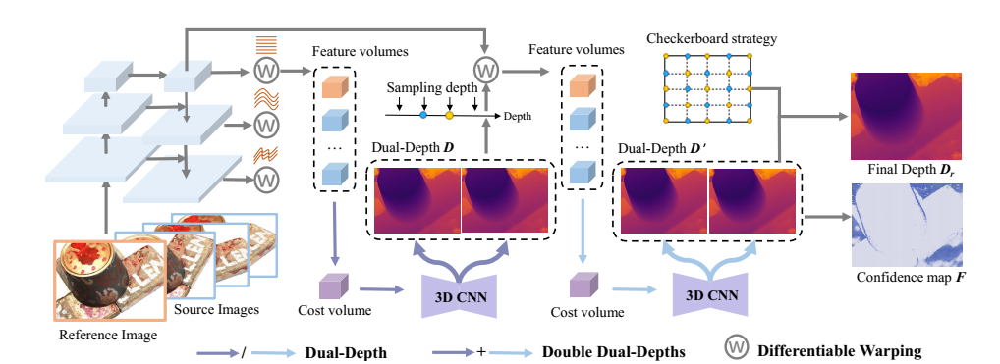
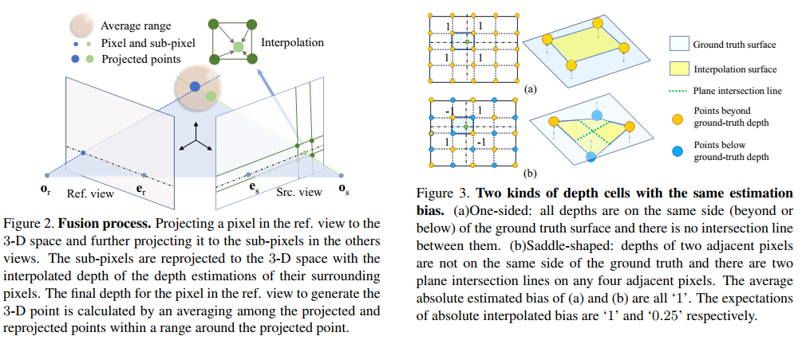

# (ICCV 2023) Constraining Depth Map Geometry for Multi-View Stereo: A Dual-Depth Approach with Saddle-shaped Depth Cells

- Xinyi Ye, Weiyue Zhao, Tianqi Liu, Zihao Huang, Zhiguo Cao, Xin Li

## Paper |  Project Page |[Arxiv](https://arxiv.org/abs/2307.09160) | Model  (Codes will be released soon)



# Highlights


In this work,**we propose a fresh viewpoint for considering depth geometry in multi-view stereo, a factor that has not been adequately concerned in prior works**. We demonstrated that different depth geometries suffer from significant performance gaps, even for the same depth estimation error case in the MVS reconstruction task both qualitatively and quantitatively. Based on the concept, we proposed the depth geometry with saddle-shaped cells  for the first time and a dual-depth approach to constraint depth map to approach the proposed geometry.

# Abstract

Learning-based multi-view stereo (MVS) methods deal with predicting accurate depth maps to achieve an accurate and complete 3D representation. Despite the excellent performance, existing methods ignore the fact that a suitable depth geometry is also critical in MVS. In this paper, we demonstrate that different depth geometries have significant performance gaps, even using the same depth prediction error. Therefore, we introduce an ideal depth geometry composed of **Saddle-Shaped Cell**s, whose predicted depth map oscillates upward and downward around the ground-truth surface, rather than maintaining a continuous and smooth depth plane. To achieve it, we develop a coarse-to-fine framework called Dual-MVSNet (DMVSNet),  which can produce an oscillating depth plane. Technically, we predict two depth values for each pixel (**Dual-Depth**), and propose a novel loss function and a checkerboard-shaped selecting strategy to constrain the predicted depth geometry. Compared to existing methods,DMVSNet achieves a high rank on the DTU benchmark and obtains the top performance on challenging scenes of Tanks and Temples, demonstrating its strong performance and generalization ability. Our method also points to a new research direction for considering depth geometry in MVS.


# citation
```bibtex

```


